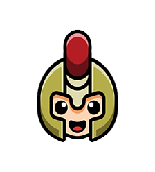
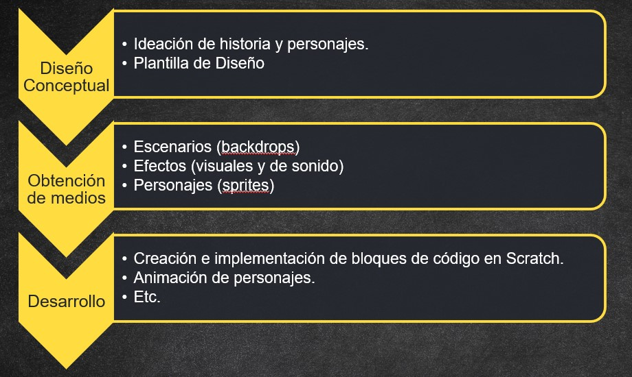
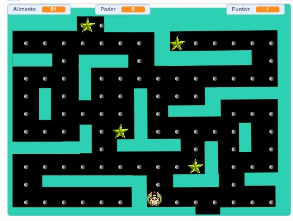

# 
 **Dasel Pacman** - Post Mortem 

## **Contenido**
  
  - [Overview](#overview)
    - [El equipo](#el-equipo)
  - [Qué fue bien](#qué-fue-bien)
    - [Pacman, un juego perfecto para todos](#pacman-un-juego-perfecto-para-todos)
    - [Uso de metodología cascada](#uso-de-metodología-cascada)
    - [Habilidades mixtas del equipo de trabajo](#habilidades-mixtas-del-equipo-de-trabajo)
  - [Qué no fue tan bien](#qué-no-fue-tan-bien)
    - [Tiempo de preproducción](#tiempo-de-preproducción)
    - [Scratch como herramienta colaborativa](#scratch-como-herramienta-colaborativa)
    - [Bajo dominio de Scratch](#bajo-dominio-de-scratch)
    - [Tiempo de producción](#tiempo-de-producción)
  - [Conclusión](#conclusión)
  - [Proyecto en Scratch](#ir-al-proyecto-en-scratch)

## **Overview**

Dasel Pacman es un juego inspirado en el clásico Pac-Man de Toru Iwatani modificando elementos audiovisuales y contando una historia un poco diferente.

En esta aventura, Dasel intenta escapar del planeta Kepler desde el núcleo cruzando laberintos y escapando de cuatro guardias que, en todo momento, intentarán detenerlo. Para conseguir superar cada laberinto, este héroe deberá recolectar todas las semillas del escenario.

Dasel podrá adquirir algunas habilidades de manera temporal para detener y atrapar a los guardias, esto le permitirá ganar algo de tiempo para la recolección de las semillas.

Durante este camino de pre-producción y desarrollo, se tuvieron en cuenta distintos elementos, tanto de corte creativo como de diseño y de desarrollo orientado principalmente al propósito académico de experimentar en una escala reducida el disciplinado proceso para la producción de un producto de estas características.

### **El equipo**

Para alcanzar esta meta, trabajamos de manera conjunta,

* Freddy Martínez
* Andrés López
* Miguel Angel Ortega
* Daniel Calderón

## **Qué fue bien**

### **Pacman, un juego perfecto para todos**

Es innegable que, aún actualmente, Pac-Man sigue siendo un video juego que se puede disfrutar sin importar la edad, esto facilita y ayuda a la acogida que este pueda tener en el público.

Esto mismo, esta nostalgia, resulta ser también un componente de apoyo creativo pues, lleva al equipo completo a sumergirse en una aventura para crear una versión propia.

### **Uso de metodología cascada**

Teniendo en cuenta la dinámica del ejercicio, este se llevó a cabo usando metodología en cascada pues, básicamente, las fases transcurrieron de la siguiente manera,

* Diseño conceptual
* Obtención de medios para Scratch y creación del proyecto.
* Desarrollo (animación del videojuego en Scratch)
  
 

Para este contexto, el académico, la metodología resulta particularmente útil pues encaja con la mecánica de los "Ejes" trabajados en la asignatura. Los entregables iban apilando cada vez un nuevo nivel en el entendimiento y construcción del video juego.

### **Habilidades mixtas del equipo de trabajo**

Los talentos en el equipo fueron diversos y bastante complementarios. Se encontró un poco de todo como creatividad, destrezas analíticas y de diseño que permitieron la creación de una historia y una dinámica de juego por el que valió la pena apostar.

Descubrimos diferentes maneras de trabajar con los elementos de Scratch no sólo para reducir el esfuerzo necesario en algunos casos sino también para dar un mejor aprovechamiento de algunas animaciones para pantallas fuera de los tableros de juego.

## **Qué no fue tan bien**

### **Tiempo de preproducción**

Uno de los elementos más importantes de un video juego es el aspecto audiovisual. Teniendo esto en cuenta, el tiempo con el que se contó para tal actividad no permitía llevar a cabo un diseño propio tanto de personajes como de escenarios, resultando necesario el uso de recursos disponibles en la red. 

De igual manera, no hubo mayor oportunidad de ahondar en una historia más allá del contexto general, nutriendo más la experiencia del jugador.

### **Scratch como herramienta colaborativa**

Durante las actividades de producción, se tenía la expectativa de que Scratch permitiría trabajar a todos los miembros de manera colaborativa al mejor estilo de la edición de documentos MS Office o G Docs, sin embargo, esto no sucedió así. 

El equipo estuvo trabajando sobre el mismo proyecto haciendo uso del navegador, sin embargo, durante un punto de control, fue evidente que los cambios de uno no eran visibles para el resto.

Así pues, resultó necesario sincronizar el trabajo a la vieja usanza, exportando cada uno el contenido trabajado y suministrandolo a un "centralizador" para que fuese importado al proyecto. 

Por supuesto, como en toda actividad de desarrollo, se encontraron algunos conflictos y fue necesario resolverlos. Esto no sólo significó tiempo adicional sino mayor necesidad de revisión posterior a cada importación.

### **Bajo dominio de Scratch**

Esta herramienta tiene un potencial inmenso, particularmente por la manera en como logra acercar al público en general a los fundamentos de la programación.

Sin embargo, aún una herramienta senciila puede requerir un tiempo de uso importante de uso antes de conseguir un nivel de expertise que permita lograr los efectos, animaciones y acabados deseados en un tiempo aceptable.

Teniendo en cuenta lo anterior, se tuvieron dificultades con algunas animaciones, movimientos de personajes y uso de los escenarios diseñados durante la segunda fase, entre otros.

Por supuesto, es posible argumentar que existe una cantidad importante de recursos online que pueden ayudar, sin embargo, el tiempo para buscar, filtrar, consumir, interiorizar y entender tal material también requiere tiempo.

### **Tiempo de producción**

Partiendo del ítem anterior, ante la falta de experiencia en el uso de la herramienta, el tiempo de producción puede no ser suficiente para aprender y poner en práctica lo necesario para dar vida a la idea concebida inicialmente.

En este caso, también se tuvo como obstáculo la reducción del tiempo para la producción con relación a el estimado inicial en el que, por circunstancias específicas de la asignatura, el tiempo de sustentación fue reducido en alrededor de un 40% vs el tiempo de la entrega formal.

## **Conclusión**

En términos generales, toda la experiencia fue enriquecedora pues permitió entender desde un punto de vista más realista, todo lo que conlleva la puesta en marcha para la generación de un producto de video juego. Esto sin mencionar las actividades necesarias para la divulgación, marketing, etc., por lo que se entiende esta industria de una manera menos especulativa y más a través de la perspectiva de un proyecto de desarrollo de software que requiere igual o mayor rigor en todos sus procesos y que, a diferencia de otros productos de tal industria, requiere un nivel de creatividad, diseño y experiencia mucho más nutrido y cercano al usuario, en este caso, el jugador.

   

## **Ir al proyecto en Scratch**

### [A jugar!!](https://scratch.mit.edu/projects/539606960)

